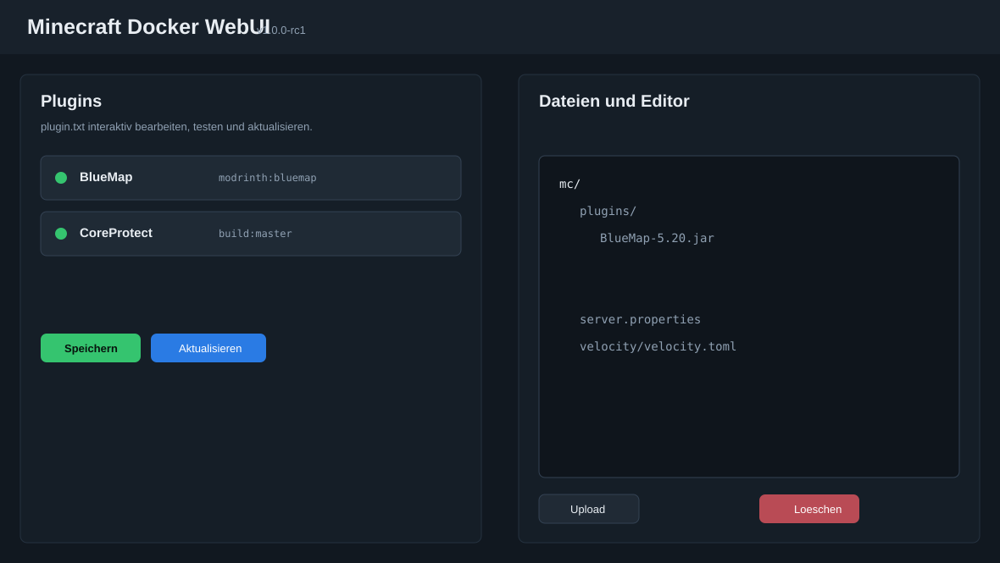

# Minecraft Docker WebUI

Eine hostbasierte Weboberflaeche zum Erstellen, Starten, Ueberwachen und Pflegen von Minecraft-Docker-Servern.

Das Projekt ist aus einem interaktiven Startscript entstanden. Der CLI-Modus ist weiterhin enthalten, aber der Hauptfokus liegt jetzt auf der WebUI: mehrere Serverprofile, Docker-Steuerung, Backups, Logs, RCON, Plugin-Verwaltung, BlueMap-Proxy und einfache Datei-/Konfig-Editoren.


## Highlights

- Mehrere Minecraft-Serverprofile mit eigenem Container, Datenordner, Ports, RAM und Version
- Docker-Aktionen direkt aus der WebUI: Anwenden, Start, Stop, Restart und Backup
- Unterstuetzung fuer `itzg/minecraft-server` Typen wie Paper, Folia, Purpur, Fabric, Forge und viele weitere
- Proxy-Unterstuetzung fuer Velocity, BungeeCord und Waterfall ueber `itzg/mc-proxy`
- Portpruefung gegen andere Profile und laufende Docker-Container
- Live-Logs, Logfenster und RCON-Konsole
- Spieleruebersicht per RCON `list` sowie Schnellbefehle fuer TP, Give, Kick, Ban und Pardon
- Zentrale Backups mit Restore und Import als neues Serverprofil
- `plugins.txt` Editor mit Plugin-Updates aus Modrinth, GitHub Releases, Spigot/Fallbacks und direkten Links
- CoreProtect-Source-Build ohne lokales `git`, mit Maven lokal oder per Docker-Container
- Manuelle Plugin-Uploads, installierte Plugins anzeigen und loeschen
- Editor fuer `server.properties`, Plugin-Konfigurationen, `velocity.toml`, `forwarding.secret` und weitere Textdateien
- Datei-Manager zum Anlegen, Umbenennen, Loeschen und Entpacken von ZIPs im Server-Datenordner
- BlueMap kann ueber die WebUI geproxied und eingebettet werden, damit spaeter ein Reverse Proxy auf die WebUI reicht



## Schnellstart

Voraussetzungen:

- Linux-Host mit Bash
- Docker
- Python 3
- `curl` oder `wget`
- Optional: `mvn` oder Docker fuer CoreProtect-Builds

Repository klonen und WebUI starten:

```bash
git clone https://github.com/JobbeDeluxe/minecraftdockerstartscript.git
cd minecraftdockerstartscript
python3 webui/app.py
```

Standardmaessig lauscht die WebUI nur lokal:

```text
http://127.0.0.1:8088
```

Fuer einen LAN-Test:

```bash
MCDOCKER_WEBUI_HOST=0.0.0.0 MCDOCKER_WEBUI_PORT=8088 python3 webui/app.py
```

Wichtig: `Speichern` sichert nur das WebUI-Profil. Druecke danach `Anwenden`, damit Version, RAM, Ports, Docker-Image, RCON und Volumes wirklich im Docker-Container aktiv werden.

## WebUI-Version

Die aktuelle WebUI zeigt ihre Version oben im Header an. Dieser Release-Kandidat ist:

```text
v1.0.0-rc1
```

Im Header gibt es ausserdem einen direkten Link zur GitHub-Projektseite.

## Screenshots


## Servertypen

Normale Minecraft-Server laufen ueber `itzg/minecraft-server`. Dazu gehoeren unter anderem:

```text
VANILLA, PAPER, FOLIA, PURPUR, SPIGOT, FABRIC, FORGE, QUILT,
BUKKIT, SPONGEVANILLA, MAGMA, MOHIST, NEOFORGE, LEAF, PUFFERFISH
```

Proxy-Server laufen ueber `itzg/mc-proxy`:

```text
VELOCITY, BUNGEECORD, WATERFALL
```

Die WebUI setzt bei Proxy-Typen automatisch das passende Docker-Image, mountet den Datenordner nach `/server` und nutzt die passenden internen Ports.

## Plugins

Die Plugin-Verwaltung liest und schreibt `DATA_DIR/plugins.txt`.

Beispiele:

```text
BlueMap modrinth:bluemap
Geyser modrinth:geyser
Floodgate https://github.com/GeyserMC/Floodgate
WorldEdit modrinth:worldedit
DiscordSRV modrinth:discordsrv
CoreProtect https://github.com/PlayPro/CoreProtect
CoreProtect build:master
```

Zeilen mit `#` am Anfang sind deaktiviert. Nach Plugin-Updates fragt die WebUI nach einem Restart, damit der Server die neuen JARs laedt.

## Backups und Import

Backups werden zentral abgelegt und enthalten den Containernamen im Dateinamen. Dadurch kann ein alter Server geloescht und bei Bedarf spaeter wieder als neues Profil importiert werden.

Der Restore stoppt den betroffenen Container, entpackt das Backup in den Datenordner und gibt Statusmeldungen im Ergebnisfenster aus.

## BlueMap und Reverse Proxy

Wenn BlueMap als Plugin installiert ist, kann der BlueMap-Port in `Extra Ports` gemappt werden, zum Beispiel:

```text
8100:8100/tcp
```

Die WebUI stellt BlueMap dann unter diesem Pfad bereit:

```text
/map/<server-id>/
```

Damit muss der Browser spaeter nicht direkt den BlueMap-Port erreichen. Ein Reverse Proxy auf die WebUI reicht.

## CLI-Modus

Das alte interaktive Script ist weiterhin enthalten:

```bash
chmod +x start_minecraft.sh
./start_minecraft.sh
```

Es kann weiterhin fuer klassische Terminal-Workflows genutzt werden. Die WebUI nutzt zusaetzlich `webui/backend.sh`, um Aktionen nicht-interaktiv auszufuehren.

## Sicherheit

Die WebUI kann Docker-Container starten, stoppen, loeschen und Daten im Serverordner veraendern. Sie sollte nicht ungeschuetzt oeffentlich erreichbar sein.

Empfehlung fuer produktive Nutzung:

- WebUI nur hinter Reverse Proxy mit Login veroeffentlichen
- RCON-Passwoerter pro Server eindeutig setzen
- Ports pro Server bewusst trennen
- Vor groesseren Aenderungen Backup erstellen

## Status

`v1.0.0-rc1` ist als erster oeffentlicher Release-Kandidat gedacht. Das Ziel ist eine praktische, hostinstallierte Alternative zu groesseren Panels, ohne die vorhandene Docker-Logik zu verstecken.
