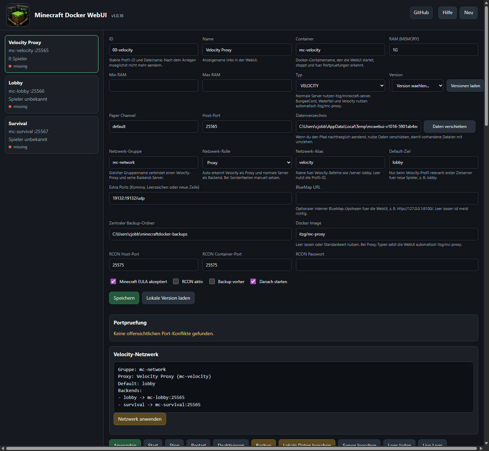
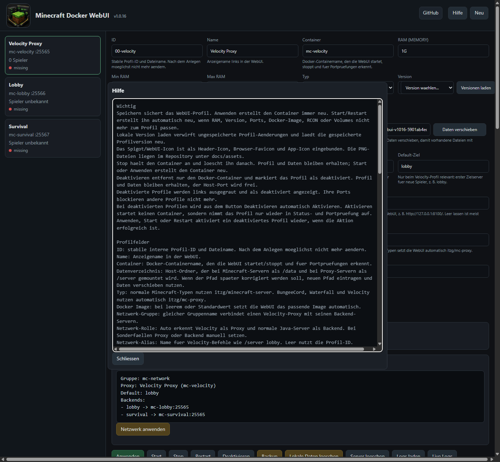

# Minecraft Docker WebUI

Version: `v1.0.16`

GitHub: <https://github.com/JobbeDeluxe/minecraftdockerstartscript>

Host-WebUI fuer Minecraft-Server in Docker. Die WebUI speichert Serverprofile als JSON unter
`~/.minecraftdocker-webui/servers`, schreibt daraus temporaere Shell-Config-Dateien und ruft `webui/backend.sh`
nicht-interaktiv auf.

## Screenshots

Live-Beispiel einer laufenden WebUI-Instanz:



Hilfe-Dialog mit den wichtigsten Bedienhinweisen:



## Icons

Die WebUI bindet das Spigot/WebUI-Icon im Header, als Favicon und als App-Icon ein. Die PNG-Dateien
liegen im Repository unter:

- `../docs/assets/minecraft-docker-webui-spigot-icon-96.png`
- `../docs/assets/minecraft-docker-webui-icon-128.png`

Ausgeliefert werden sie durch die WebUI unter `/assets/...`.

## Start

```bash
cd /pfad/zum/repository
python3 webui/app.py
```

Danach lokal oeffnen:

```text
http://127.0.0.1:8088
```

Der Server bindet absichtlich nur an `127.0.0.1`. Fuer Tests im LAN kann der Host geaendert werden:

```bash
MCDOCKER_WEBUI_HOST=0.0.0.0 MCDOCKER_WEBUI_PORT=8088 python3 webui/app.py
```

## Was aktuell funktioniert

- Serverprofile anlegen und speichern
- Docker-Container per Profil anwenden, starten, stoppen und entfernen, neu starten
- Backup-Aktionen ueber den Backend-Runner ausloesen
- RCON pro Server aktivieren, Passwort setzen und Host-/Container-Port getrennt konfigurieren
- Offensichtliche Port-Konflikte zwischen Profilen, laufenden Docker-Containern und TCP-Ports anzeigen
- `plugins.txt` im Web bearbeiten und einfache Plugin-Updates ausloesen
- Containerstatus, einfache Docker-Stats und Logs anzeigen
- Spieleranzahl und einfache Spielerliste per RCON `list` anzeigen
- RCON-Schnellbefehle fuer `tp`, `give`, `kick`, `ban` und `pardon`
- BlueMap ueber die WebUI unter `/map/<server-id>/` proxien und einbetten
- Profile deaktivieren, ohne Profil oder Datenordner zu loeschen
- Lokale Serverdaten loeschen, ohne Profil oder zentrale Backups zu entfernen
- Datenverzeichnis nachtraeglich verschieben und das Profil automatisch anpassen
- Ungespeicherte Profil-Aenderungen mit `Lokale Version laden` verwerfen und neu aus dem lokalen WebUI-State laden
- Velocity-Netzwerkgruppen fuer Proxy und Backend-Server konfigurieren
- Mehrere Server ueber unterschiedliche Containernamen, Datenverzeichnisse und Ports verwalten

## Deaktivierte Profile

`Deaktivieren` entfernt nur den Docker-Container und setzt das Profil auf `deaktiviert`.
Profil und Datenordner bleiben erhalten. In der WebUI wird das Profil links ausgegraut und mit
Status `deaktiviert` angezeigt.

Deaktivierte Profile geben ihre Ports fuer andere Profile frei. Die Portpruefung ignoriert nur
wirklich deaktivierte Profile; aktive Profile mit gleichem Host-Port blockieren weiterhin. Sobald
du ein deaktiviertes Profil auswaehlst, wechselt der Button von `Deaktivieren` zu `Aktivieren`.
`Aktivieren` startet keinen Container, sondern nimmt das Profil nur wieder in Status- und
Portpruefung auf. `Anwenden`, `Start` oder `Restart` aktiviert ein deaktiviertes Profil nach
erfolgreicher Aktion ebenfalls automatisch wieder.

## Datenverzeichnis

Wenn ein Profil den falschen Datenordner nutzt, kann der neue Pfad im Feld `Datenverzeichnis`
eingetragen und mit `Daten verschieben` uebernommen werden. Die WebUI entfernt dafuer den
Container, verschiebt den alten Datenordner an den neuen Pfad und aktualisiert das Profil.
Zentrale Backups bleiben dabei unveraendert.

Der Datei-Browser trennt Ordner und Dateien. Ein Klick auf den Ordnernamen oeffnet den Ordner,
`Zurueck` geht eine Ebene nach oben, und `Auswahl` markiert einen Ordner fuer Umbenennen oder
Loeschen.

## Backend-Modus

Die WebUI nutzt diesen nicht-interaktiven Modus:

```bash
webui/backend.sh --config /tmp/server.env --action apply
webui/backend.sh --config /tmp/server.env --action start
webui/backend.sh --config /tmp/server.env --action stop
webui/backend.sh --config /tmp/server.env --action logs
webui/backend.sh --config /tmp/server.env --action plugins
```

Beispiel fuer eine Config:

```bash
DATA_DIR=/opt/minecraft/survival
SERVER_NAME=mc-survival
MEMORY=6G
TYPE=PAPER
VERSION=LATEST
PAPER_CHANNEL=default
HOST_PORT=25565
EXTRA_PORTS=19132:19132/udp,24454:24454/udp,8100:8100/tcp
MAP_URL=
EULA_ACCEPTED=ja
RCON_ENABLED=ja
RCON_PASSWORD=bitte-aendern
RCON_HOST_PORT=25575
RCON_CONTAINER_PORT=25575
DO_BACKUP=nein
DO_START_DOCKER=ja
```

## Plugins

Die WebUI bearbeitet `DATA_DIR/plugins.txt`. Der Update-Button unterstuetzt im Prototyp:

- `modrinth:<slug>`
- GitHub-Repositories mit `.jar` Asset im neuesten Release
- direkte `http(s)` Download-Links
- CoreProtect-Builds aus `https://github.com/PlayPro/CoreProtect` oder `https://github.com/PlayPro/CoreProtect:branch`
- manuell hochgeladene `.jar` Dateien unter `DATA_DIR/plugins/manuell`

Beispiel:

```text
BlueMap modrinth:bluemap
Geyser modrinth:geyser
Geyser-Velocity https://download.geysermc.org/v2/projects/geyser/versions/latest/builds/latest/downloads/velocity
Floodgate https://github.com/GeyserMC/Floodgate
WorldEdit modrinth:worldedit
DiscordSRV modrinth:discordsrv
DiscordSRV https://download.discordsrv.com/v2/DiscordSRV/DiscordSRV/release/download/latest/jar
CoreProtect https://github.com/PlayPro/CoreProtect
CoreProtect build:master
```

Bei `modrinth:<slug>` waehlt die WebUI den Loader passend zum Server-Typ. Velocity bevorzugt `velocity`, Bungee/Waterfall bevorzugen `bungeecord`/`waterfall`, Paper/Purpur/Folia bevorzugen Bukkit-kompatible Loader. Wenn kein passender Loader gefunden wird, wird das Plugin als Fehler gemeldet, statt eine falsche JAR zu installieren.

Zeilen mit `#` am Anfang sind deaktiviert. CoreProtect wird aus dem GitHub-Source-Zip gebaut; dafuer braucht der Host
kein `git`, aber `curl`/`wget` und entweder `mvn` oder Docker, damit der Maven-Container genutzt werden kann.
SpigotMC-/BukkitDev-Projektseiten sind in der Regel keine direkten JAR-Downloads. Die WebUI lehnt heruntergeladene
Dateien ab, wenn sie keine echte JAR/ZIP-Datei sind, und beendet das Plugin-Update dann mit Fehlercode.

## Dateien und Konfigs

Der Datei-Bereich ersetzt den separaten Plugin-Konfig-Bereich. Ordner stehen links, Dateien rechts.
Ein Klick auf einen Ordner oeffnet ihn, `Zurueck` geht eine Ebene hoch. Text-Konfigdateien wie
`velocity.toml`, `forwarding.secret`, `server.properties`, `.yml`, `.json`, `.conf` oder `.txt`
werden heller markiert und beim Anklicken direkt in den Editor darunter geladen.

`Inhalt neu laden` laedt die aktuell geoeffnete Datei erneut. `Datei speichern` schreibt die
Aenderungen zurueck. Nicht editierbare Dateien wie `.jar` oder grosse Weltdaten werden nur fuer
Umbenennen oder Loeschen ausgewaehlt.

## Velocity-Netzwerkgruppen

Mehrere Profile koennen dieselbe `Netzwerk-Gruppe` bekommen, zum Beispiel `main`. Das Velocity-Profil
ist die Rolle `Proxy`, die Java-Server sind `Backend`. Der `Netzwerk-Alias` ist der Name fuer
Velocity-Befehle wie `/server lobby`; `Default-Ziel` auf dem Velocity-Profil bestimmt, wohin neue
Spieler zuerst geschickt werden.

`Netzwerk anwenden` schreibt die Standard-Konfiguration fuer einen Velocity-Verbund:

- `velocity.toml` mit Backend-Liste, `try`, modernem Player-Forwarding und `forwarding.secret`
- `server.properties` der Backends mit deaktiviertem `online-mode`
- `config/paper-global.yml` fuer Paper/Purpur/Folia mit Velocity-Forwarding und gemeinsamem Secret
- Docker-Netzwerkdaten in den Profilen, damit die Container sich per Containername erreichen

Danach die Gruppe per `Anwenden` oder `Restart` neu erstellen. Geyser/Floodgate- oder andere
Plugin-Spezialkonfigurationen werden noch nicht automatisch angepasst.

## RCON und Ports

Bei Velocity liest die WebUI den internen Port aus `velocity.toml` (`bind`) und mappt den Host-Port auf diesen Container-Port. Dadurch funktioniert zum Beispiel ein Host-Port `25565`, obwohl Velocity im Container auf `25577` lauscht.

Bei mehreren Servern kann der interne RCON-Port meist `25575` bleiben. Der Host-Port muss eindeutig sein:

```text
Survival: 25575:25575
Creative: 25576:25575
Lobby:    25577:25575
```

Fuer Geyser oder VoiceChat die UDP-Ports in `Extra Ports` setzen, z. B. `19132:19132/udp`. Die WebUI warnt bei offensichtlichen Kollisionen, passt Plugin-Konfigurationsdateien aber noch nicht automatisch an.

Fuer BlueMap `BlueMap modrinth:bluemap` in `plugins.txt` setzen und den Web-Port mappen, z. B. `8100:8100/tcp`.
Der Button `BlueMap oeffnen` und `BlueMap einbetten` laufen ueber den WebUI-Proxy unter `/map/<server-id>/`.
Dadurch reicht spaeter ein Reverse Proxy auf die WebUI; der Browser muss den BlueMap-Port nicht direkt erreichen.
`BlueMap URL` ist der optionale Upstream fuer die WebUI, z. B. `http://127.0.0.1:8100/`. Wenn das Feld leer ist,
nutzt die WebUI lokal `127.0.0.1:8100` oder den Host-Port aus einem Mapping wie `8123:8100/tcp`.

## Backup-Fortschritt

Bei `Backup` laeuft das Archivieren im Backend weiter, waehrend die WebUI das Aktionslog pollt.
Alle 5 Sekunden schreibt das Backend die aktuelle Archivgroesse und die verstrichene Zeit ins Log.
So bleibt im Ergebnisfenster sichtbar, ob ein grosses Backup noch arbeitet.

## Sicherheit

Die WebUI kann Docker-Container starten und stoppen. Sie sollte nicht ohne Authentifizierung oeffentlich erreichbar
sein. Fuer den ersten Test ist eine Host-Installation mit Zugriff auf Docker am einfachsten.
